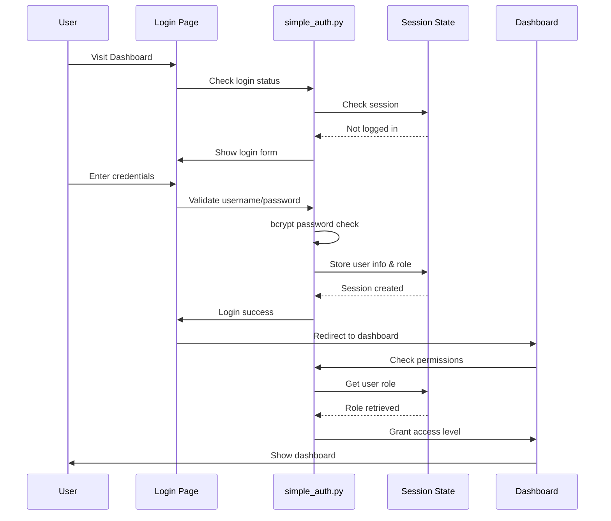
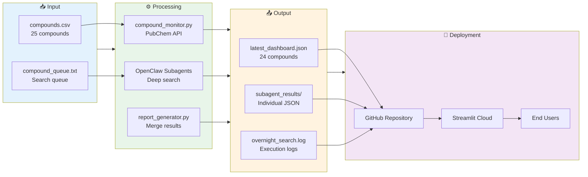
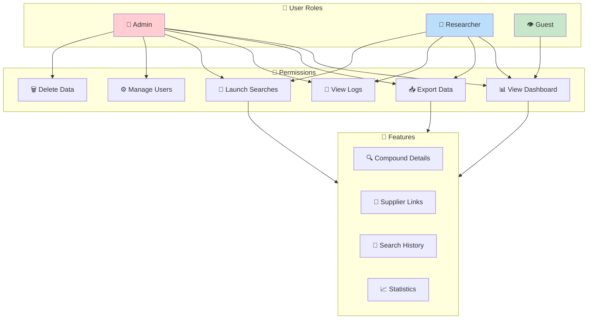
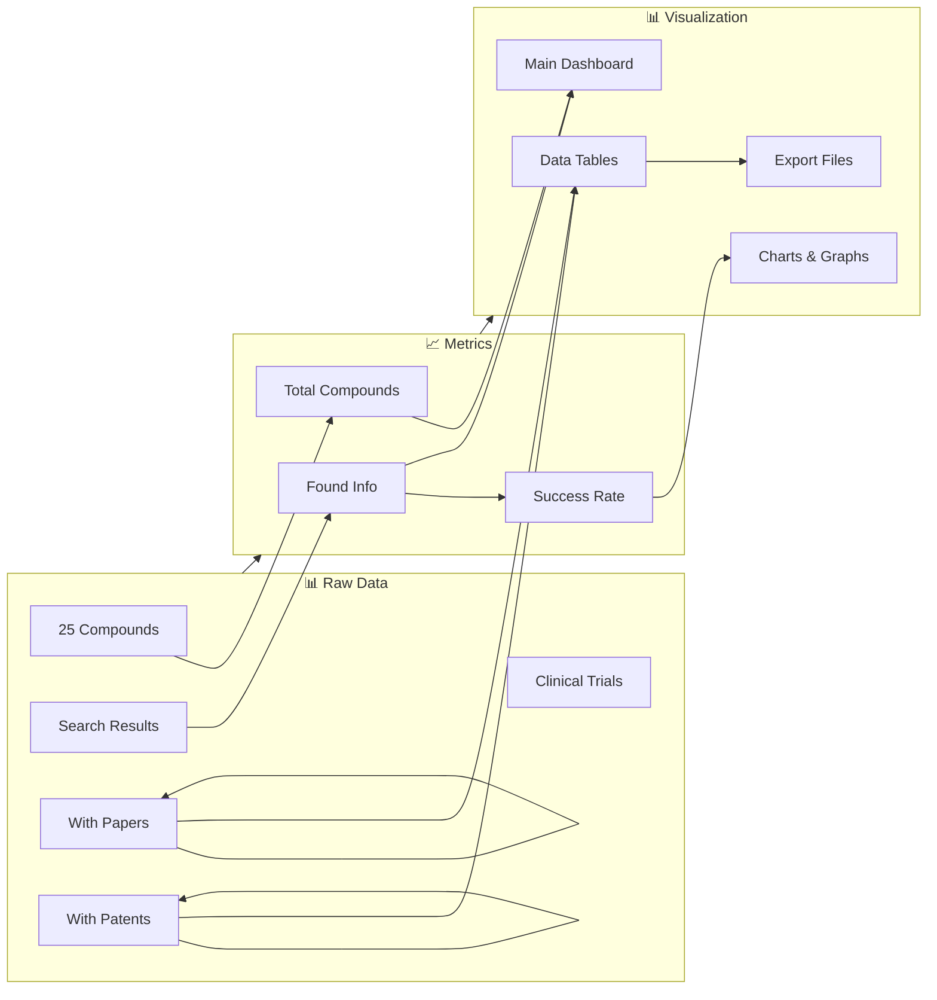
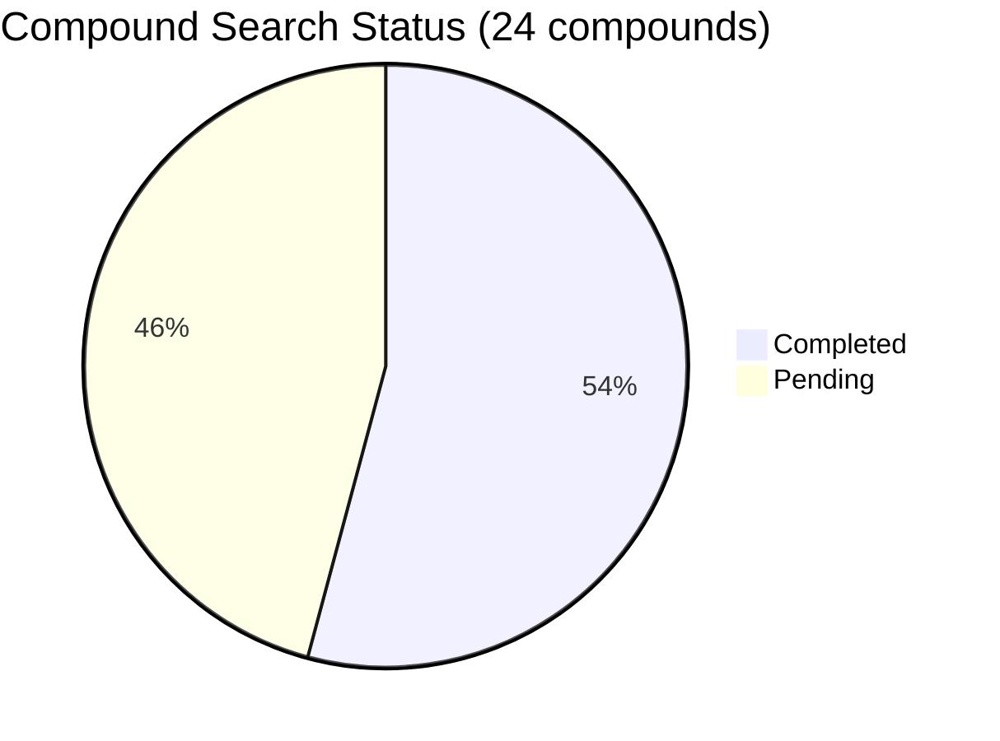
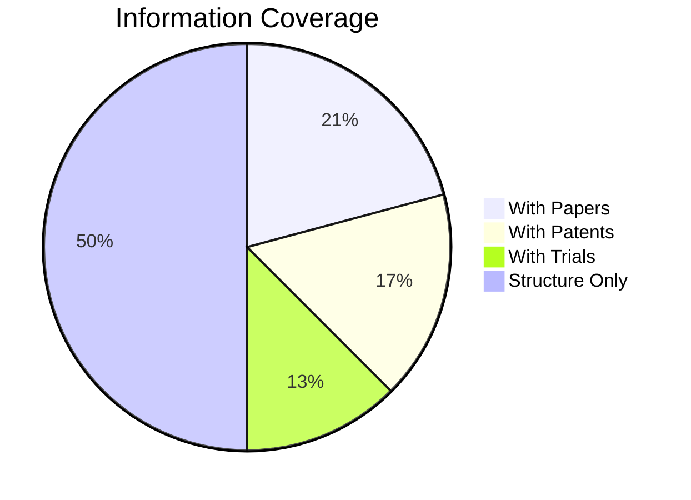

# 🧪 Drug Price Monitoring System - Workflow Diagram

## 📊 Complete System Architecture

```mermaid
flowchart TB
    subgraph Users["👥 Users"]
        Admin[🔐 Admin]
        Researcher[🔬 Researcher]
        Guest[👁️ Guest]
    end
    
    subgraph Frontend["🖥️ Frontend - Streamlit Dashboard"]
        Login[🔐 Login Page]
        Dashboard[📊 Main Dashboard]
        CompoundView[🔍 Compound Details]
        Export[📥 Export Data]
    end
    
    subgraph Auth["🔒 Authentication System"]
        SimpleAuth[🔑 simple_auth.py]
        SessionState[💾 Session State]
        RoleCheck[🎯 Role Check]
    end
    
    subgraph Backend["⚙️ Backend Processing"]
        CompoundMonitor[🧪 compound_monitor.py]
        SubagentQueue[🤖 Subagent Queue]
        ReportGen[📄 report_generator.py]
        QueueProcessor[📋 process_queue.py]
    end
    
    subgraph DataSources["📚 Data Sources"]
        PubChem[🔬 PubChem API]
        Subagents[🤖 OpenClaw Subagents]
        Suppliers[🏪 Suppliers<br/>MCE/TCI/Enamine/Sigma]
        Patents[📜 Patent Databases]
        Papers[📚 PubMed/Google Scholar]
        Trials[🏥 ClinicalTrials.gov]
    end
    
    subgraph Storage["💾 Data Storage"]
        CompoundsCSV[📄 compounds.csv]
        SubagentResults[📁 subagent_results/]
        DashboardJSON[📊 latest_dashboard.json]
        Logs[📝 Logs]
    end
    
    subgraph Automation["🤖 Automation"]
        CronJob[⏰ Cron Job<br/>02:00 daily]
        OvernightSearch[🌙 overnight_search.py]
        GitHubActions[⚡ GitHub Actions]
    end
    
    subgraph Deployment["🚀 Deployment"]
        GitHub[💻 GitHub Repository]
        StreamlitCloud[☁️ Streamlit Cloud]
    end
    
    %% User Flow
    Admin --> Login
    Researcher --> Login
    Guest --> Login
    
    Login --> SimpleAuth
    SimpleAuth --> SessionState
    SessionState --> RoleCheck
    RoleCheck --> Dashboard
    
    %% Dashboard Flow
    Dashboard --> CompoundView
    Dashboard --> Export
    RoleCheck -.->|Permissions| Export
    
    %% Data Flow
    Dashboard --> DashboardJSON
    CompoundView --> DashboardJSON
    
    %% Monitoring Flow
    CompoundMonitor --> PubChem
    CompoundMonitor --> SubagentQueue
    
    SubagentQueue --> Subagents
    Subagents --> PubChem
    Subagents --> Suppliers
    Subagents --> Patents
    Subagents --> Papers
    Subagents --> Trials
    
    Subagents --> SubagentResults
    SubagentResults --> ReportGen
    ReportGen --> DashboardJSON
    
    %% Queue Processing
    CompoundsCSV --> QueueProcessor
    QueueProcessor --> SubagentQueue
    OvernightSearch --> QueueProcessor
    
    %% Automation
    CronJob --> OvernightSearch
    GitHubActions --> CompoundMonitor
    
    %% Storage
    DashboardJSON --> GitHub
    SubagentResults --> GitHub
    CompoundsCSV --> GitHub
    
    %% Deployment
    GitHub --> StreamlitCloud
    StreamlitCloud --> Frontend
    
    %% Logs
    CompoundMonitor --> Logs
    QueueProcessor --> Logs
    SimpleAuth --> Logs
    
    %% Styling
    classDef userClass fill:#e1f5fe,stroke:#01579b,stroke-width:2px
    classDef frontendClass fill:#f3e5f5,stroke:#4a148c,stroke-width:2px
    classDef authClass fill:#ffebee,stroke:#b71c1c,stroke-width:2px
    classDef backendClass fill:#e8f5e9,stroke:#1b5e20,stroke-width:2px
    classDef dataClass fill:#fff3e0,stroke:#e65100,stroke-width:2px
    classDef storageClass fill:#eceff1,stroke:#263238,stroke-width:2px
    classDef autoClass fill:#f9fbe7,stroke:#33691e,stroke-width:2px
    classDef deployClass fill:#e3f2fd,stroke:#0d47a1,stroke-width:2px
    
    class Admin,Researcher,Guest userClass
    class Login,Dashboard,CompoundView,Export frontendClass
    class SimpleAuth,SessionState,RoleCheck authClass
    class CompoundMonitor,SubagentQueue,ReportGen,QueueProcessor backendClass
    class PubChem,Subagents,Suppliers,Patents,Papers,Trials dataClass
    class CompoundsCSV,SubagentResults,DashboardJSON,Logs storageClass
    class CronJob,OvernightSearch,GitHubActions autoClass
    class GitHub,StreamlitCloud deployClass
```

---

## 🔄 Authentication Flow

---

## 🤖 Subagent Search Workflow

```mermaid
flowchart LR
    subgraph Init[🚀 Initialization]
        Start[Start Search]
        LoadQueue[Load compound_queue.txt]
        Validate[Validate compound list]
    end
    
    subgraph Search[🔍 Search Process]
        ForEach[For each compound]
        Spawn[Spawn Subagent]
        Timeout{Timeout?<br/>600s}
        Retry[Retry if failed]
    end
    
    subgraph Collect[📥 Data Collection]
        SaveResult[Save to subagent_results/]
        ExtractData[Extract key info]
        ValidateData[Validate data quality]
    end
    
    subgraph Update[📊 Dashboard Update]
        MergeData[Merge with dashboard]
        UpdateStats[Update statistics]
        SaveJSON[Save latest_dashboard.json]
    end
    
    subgraph Deploy[🚀 Deployment]
        GitAdd[git add]
        GitCommit[git commit]
        GitPush[git push]
        StreamlitRedeploy[Streamlit auto-redeploy]
    end
    
    Start --> LoadQueue
    LoadQueue --> Validate
    Validate --> ForEach
    ForEach --> Spawn
    Spawn --> Timeout
    Timeout -->|Yes| Retry
    Timeout -->|No| Collect
    Retry --> Spawn
    Collect --> SaveResult
    SaveResult --> ExtractData
    ExtractData --> ValidateData
    ValidateData --> Update
    Update --> MergeData
    MergeData --> UpdateStats
    UpdateStats --> SaveJSON
    SaveJSON --> Deploy
    Deploy --> GitAdd
    GitAdd --> GitCommit
    GitCommit --> GitPush
    GitPush --> StreamlitRedeploy
```

---

## 📊 Data Flow Architecture

---

## 🎯 Role-Based Access Control

---

## ⏰ Automation Schedule

```mermaid
gantt
    title Daily Automation Schedule (GMT+8)
    dateFormat HH:mm
    axisFormat %H:%M
    
    section Night Batch
    Overnight Search Start :02:00, 5m
    Compound Batch 1 :02:05, 10m
    Compound Batch 2 :02:15, 10m
    Compound Batch 3 :02:25, 10m
    Save Results :02:35, 5m
    Update Dashboard :02:40, 5m
    Git Commit & Push :02:45, 5m
    Streamlit Redeploy :02:50, 10m
    
    section Day Operations
    Manual Searches :09:00, 480m
    Dashboard Updates :12:00, 60m
    Report Generation :17:00, 30m
```

---

## 📈 System Statistics Flow

---

## 🔧 Key Components

| Component | File | Purpose |
|-----------|------|---------|
| **Dashboard** | `dashboard_streamlit.py` | Main UI with authentication |
| **Simple Auth** | `simple_auth.py` | User authentication & roles |
| **Monitor** | `compound_monitor.py` | PubChem API searches |
| **Queue Processor** | `process_queue.py` | Overnight batch processing |
| **Report Generator** | `report_generator.py` | Merge & format results |
| **Compound Queue** | `compound_queue.txt` | Search queue (10 compounds) |
| **Results** | `subagent_results/` | Individual search results |
| **Dashboard Data** | `monitor_output/latest_dashboard.json` | Live dashboard data |

---

## 🎯 Key Metrics (Current)

---

**Last Updated:** 2026-03-12 13:24 GMT+8  
**Total Compounds:** 24  
**Completion Rate:** 54%
